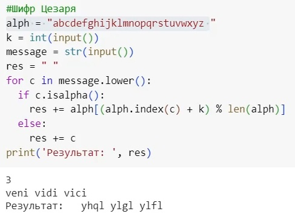
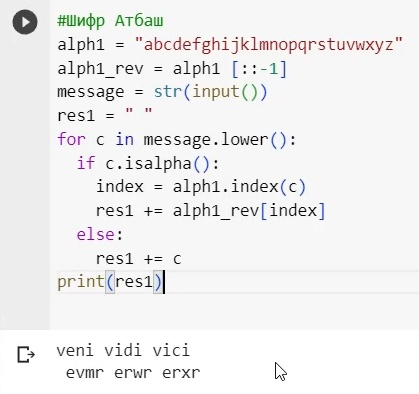

---
## Front matter
lang: ru-RU
title: Лабораторная работа №1
subtitle: Математические основы защиты информации и информационной безопасности
author:
  - Назарьин Артем 
  - НПМмд-02-23
  
date: 20 сентября 2023

## i18n babel
babel-lang: russian
babel-otherlangs: english

## Formatting pdf
toc: false
toc-title: Содержание
slide_level: 2
aspectratio: 169
section-titles: true
theme: metropolis
header-includes:
 - \metroset{progressbar=frametitle,sectionpage=progressbar,numbering=fraction}
 - '\makeatletter'
 - '\beamer@ignorenonframefalse'
 - '\makeatother'
---

# Информация

## Докладчик

:::::::::::::: {.columns align=center}
::: {.column width="70%"}

  * Назарьин Артем Игоревич
  * <https://github.com/PureCrouch>

:::
::: {.column width="30%"}

:::
::::::::::::::

#Шифры простой замены

## Цель работы
- Реализовать шифр Цезаря шифр Атбаш.
- Реализовать шифр Атбаш

## Материалы и методы
- Rocky Linux
- VM Virtual Box
- Python

## Ход работы
- Реализую шифр Цезаря

## Ход работы

## Ход работы 
- Реализую шифр Атбаш

## Ход работы 

# Вывод

Я приобрел практические навыки установки операционной системы на виртуальную машину и настроил минимально необходимые для дальнейшей работы сервисы.

