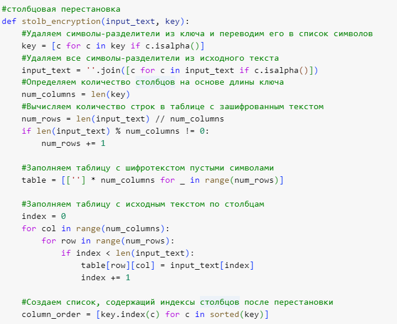
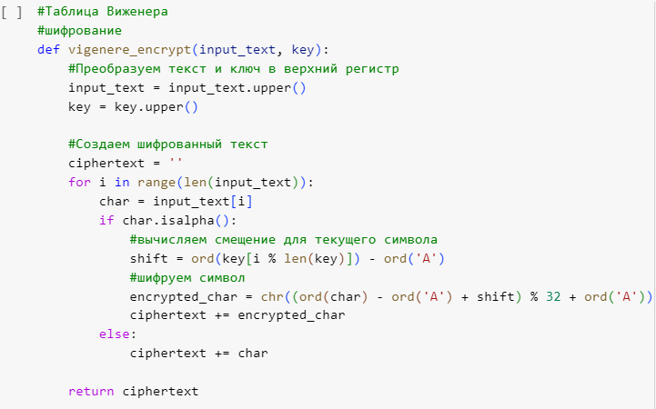

---
## Front matter
lang: ru-RU
title: Лабораторная работа №2
author: |
	Назарьин Артем. - НПМмд-02-23
date: 27.09.2023

## Formatting pdf
toc: false
toc-title: Содержание
slide_level: 2
aspectratio: 169
section-titles: true
theme: metropolis
header-includes:
 - \metroset{progressbar=frametitle,sectionpage=progressbar,numbering=fraction}
 - '\makeatletter'
 - '\beamer@ignorenonframefalse'
 - '\makeatother'
---

# Шифр перестановок, решеток, таблицы Виженера

## Цель выполнения лабораторной работы

Реализовать шифрование перестановками, шифрование с помощью решеток и таблицы Виженера.

## Выполнение

- Реализую маршрутное шифрование перестановками

{ #fig:001 width=50% }

## Выполнение

{ #fig:002 width=50% }

## Выполнение

- Реализую шифрование с помощью таблицы Виженера.
Исходный текст: криптография серьезная наука; пароль – математика. Итоговый результат частично не совпал с примером из задания, поскольку в задании была представлена таблица с неполным алфавитом.

## Выполнение

{ #fig:003 width=50% }

## Выполнение

{ #fig:004 width=50% }

## Выводы

Я реализовал шифрование перестановками и шифрование с помощью таблицы Виженера.
