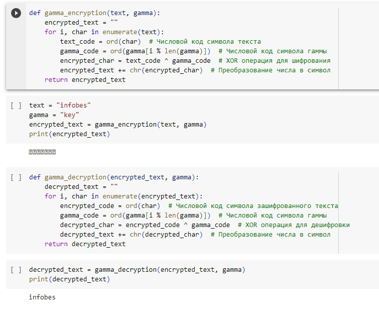

---
## Front matter
lang: ru-RU
title: Лабораторная работа №2
author: |
	Назарьин Артем. - НПМмд-02-23
date: 14.10.2023

## Formatting pdf
toc: false
toc-title: Содержание
slide_level: 2
aspectratio: 169
section-titles: true
theme: metropolis
header-includes:
 - \metroset{progressbar=frametitle,sectionpage=progressbar,numbering=fraction}
 - '\makeatletter'
 - '\beamer@ignorenonframefalse'
 - '\makeatother'
---

# Шифрование гаммированием

## Цель выполнения лабораторной работы

Реализовать алгоритм шифрования гаммированием конечной гаммой.

## Выполнение

- Реализую алгоритм шифрования гаммированием конечной гаммой.

{ #fig:001 width=50% }

## Выводы

Я реализовал алгоритм шифрования гаммированием конечной гаммой.
